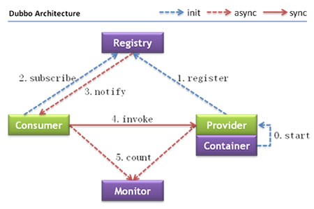

# SSM-SOA
第二天：淘淘分布式项目主框架

知识点：
* dubbo，zookeeper的使用
* PageHelper分页
* EasyUI的datagrid的使用，分页

## 系统间通信
由于淘淘商城是基于soa的架构，表现层和服务层是不同的工程。
所以要实现商品列表查询需要两个系统之间进行通信。

如何实现远程通信？
* 1、Webservice：效率不高基于soap协议。项目中不推荐使用。
* 2、使用restful形式的服务：http+json。很多项目中应用。
如果服务太多，服务之间调用关系混乱，需要治疗服务。
* 3、使用dubbo。使用rpc协议进行远程调用，直接使用socket通信。
传输效率高，并且可以统计出系统之间的调用关系、调用次数。

## 什么是dubbo
随着互联网的发展，网站应用的规模不断扩大，常规的垂直应用架构已无法应对，
分布式服务架构以及流动计算架构势在必行，亟需一个治理系统确保架构有条不紊的演进。

* 单一应用架构 
    * 当网站流量很小时，只需一个应用，将所有功能都部署在一起，以减少部署节点和成本。
    * 此时，用于简化增删改查工作量的 数据访问框架(ORM) 是关键。
* 垂直应用架构 
    * 当访问量逐渐增大，单一应用增加机器带来的加速度越来越小，将应用拆成互不相干的几个应用，以提升效率。
    * 此时，用于加速前端页面开发的 Web框架(MVC) 是关键。
* 分布式服务架构 
    * 当垂直应用越来越多，应用之间交互不可避免，将核心业务抽取出来，作为独立的服务，逐渐形成稳定的服务中心，使前端应用能更快速的响应多变的市场需求。
    * 此时，用于提高业务复用及整合的 分布式服务框架(RPC) 是关键。
* 流动计算架构 
    * 当服务越来越多，容量的评估，小服务资源的浪费等问题逐渐显现，此时需增加一个调度中心基于访问压力实时管理集群容量，提高集群利用率。
    * 此时，用于提高机器利用率的 资源调度和治理中心(SOA) 是关键。

Dubbo就是资源调度和治理中心的管理工具。

## Dubbo的架构


节点角色说明：
* Provider: 暴露服务的服务提供方。
* Consumer: 调用远程服务的服务消费方。
* Registry: 服务注册与发现的注册中心。
* Monitor: 统计服务的调用次调和调用时间的监控中心。
* Container: 服务运行容器。

调用关系说明：
* 1、服务容器负责启动，加载，运行服务提供者。
* 2、服务提供者在启动时，向注册中心注册自己提供的服务。
* 3、服务消费者在启动时，向注册中心订阅自己所需的服务。
* 4、注册中心返回服务提供者地址列表给消费者，如果有变更，注册中心将基于长连接推送变更数据给消费者。
* 5、服务消费者，从提供者地址列表中，基于软负载均衡算法，选一台提供者进行调用，如果调用失败，再选另一台调用。
* 6、服务消费者和提供者，在内存中累计调用次数和调用时间，定时每分钟发送一次统计数据到监控中心。

使用方法
Dubbo采用全Spring配置方式，透明化接入应用，对应用没有任何API侵入，
只需用Spring加载Dubbo的配置即可，Dubbo基于Spring的Schema扩展进行加载。

单一工程中spring的配置
```xml
    <bean id="xxxService" class="com.xxx.XxxServiceImpl" />
    <bean id="xxxAction" class="com.xxx.XxxAction">
       	<property name="xxxService" ref="xxxService" />
    </bean>
```

远程服务：
在本地服务的基础上，只需做简单配置，即可完成远程化：

将上面的local.xml配置拆分成两份，将服务定义部分放在服务提供方remote-provider.xml，
将服务引用部分放在服务消费方remote-consumer.xml。
并在提供方增加暴露服务配置<dubbo:service>，在消费方增加引用服务配置<dubbo:reference>。

发布服务：
```xml
<!-- 和本地服务一样实现远程服务 -->
<bean id="xxxService" class="com.xxx.XxxServiceImpl" />
<!-- 增加暴露远程服务配置 -->
<dubbo:service interface="com.xxx.XxxService" ref="xxxService" />
```
调用服务：
```xml
<!-- 增加引用远程服务配置 -->
<dubbo:reference id="xxxService" interface="com.xxx.XxxService" />
<!-- 和本地服务一样使用远程服务 -->
<bean id="xxxAction" class="com.xxx.XxxAction">
	<property name="xxxService" ref="xxxService" />
</bean>
```

## 注册中心
注册中心负责服务地址的注册与查找，相当于目录服务，服务提供者和消费者只在启动时与注册中心交互，
注册中心不转发请求，压力较小。使用dubbo-2.3.3以上版本，建议使用zookeeper注册中心。
Zookeeper是Apacahe Hadoop的子项目，是一个树型的目录服务，支持变更推送，
适合作为Dubbo服务的注册中心，工业强度较高，可用于生产环境，并推荐使用

linux下Zookeeper的安装：
第一步：安装jdk
第二步：解压缩zookeeper压缩包
第三步：将conf文件夹下zoo_sample.cfg复制一份，改名为zoo.cfg
第四步：修改配置dataDir属性，指定一个真实目录
第五步：
启动zookeeper：bin/zkServer.sh start
关闭zookeeper：bin/zkServer.sh stop
查看zookeeper状态：bin/zkServer.sh status
注意要关闭linux的防火墙。