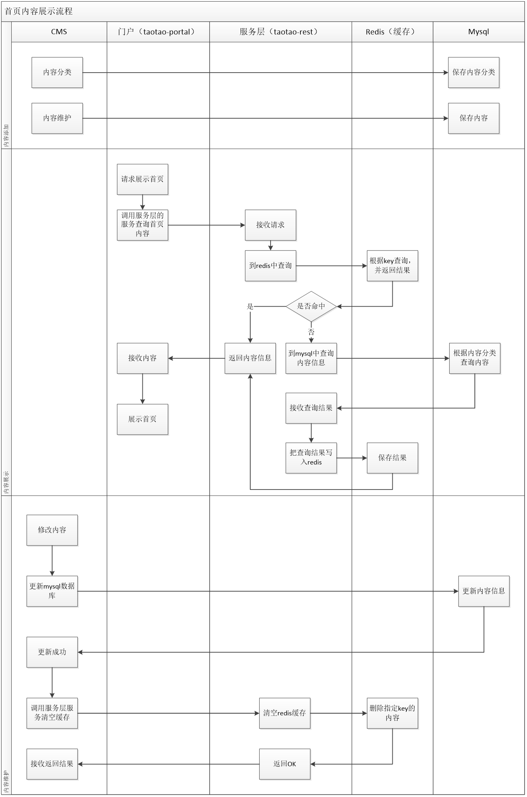

# SSM-SOA
## 第五天：redis

### redis缓存逻辑图


# redis的使用

## Redis 安装
Window 下安装
下载地址：https://github.com/MSOpenTech/redis/releases。
Redis 支持 32 位和 64 位。这个需要根据你系统平台的实际情况选择，
这里我们下载 Redis-x64-xxx.zip压缩包到 C 盘，解压后，将文件夹重新命名为 redis。

打开一个 cmd 窗口 
使用cd命令切换目录到 C:\redis 运行 redis-server.exe redis.windows.conf 。

## 数据类型
Redis支持五种数据类型：string（字符串），hash（哈希），list（列表），set（集合）及zset(sorted set：有序集合)。
### String（字符串）
```xml
redis 127.0.0.1:6379> SET name "runoob"
OK
redis 127.0.0.1:6379> GET name
"runoob"
```
### Hash（哈希）
```xml
redis> HMSET myhash field1 "Hello" field2 "World"
"OK"
redis> HGET myhash field1
"Hello"
redis> HGET myhash field2
"World"
```

### List（列表）
```xml
redis 127.0.0.1:6379> lpush runoob redis
(integer) 1
redis 127.0.0.1:6379> lpush runoob mongodb
(integer) 2
redis 127.0.0.1:6379> lpush runoob rabitmq
(integer) 3
redis 127.0.0.1:6379> lrange runoob 0 10
1) "rabitmq"
2) "mongodb"
3) "redis"
redis 127.0.0.1:6379>
```
### Set（集合）
```xml
redis 127.0.0.1:6379> sadd runoob redis
(integer) 1
redis 127.0.0.1:6379> sadd runoob mongodb
(integer) 1
redis 127.0.0.1:6379> sadd runoob rabitmq
(integer) 1
redis 127.0.0.1:6379> sadd runoob rabitmq
(integer) 0
redis 127.0.0.1:6379> smembers runoob

1) "redis"
2) "rabitmq"
3) "mongodb"
```
### zset(sorted set：有序集合)
```xml
redis 127.0.0.1:6379> zadd runoob 0 redis
(integer) 1
redis 127.0.0.1:6379> zadd runoob 0 mongodb
(integer) 1
redis 127.0.0.1:6379> zadd runoob 0 rabitmq
(integer) 1
redis 127.0.0.1:6379> zadd runoob 0 rabitmq
(integer) 0
redis 127.0.0.1:6379> > ZRANGEBYSCORE runoob 0 1000
1) "mongodb"
2) "rabitmq"
3) "redis"
```

## 序号	命令及描述
```xml
 1	DEL key
     该命令用于在 key 存在时删除 key。
   
 2	DUMP key 
    序列化给定 key ，并返回被序列化的值。
    
 3	EXISTS key 
    检查给定 key 是否存在。
    
 4	EXPIRE key seconds
    为给定 key 设置过期时间。
    
 5	EXPIREAT key timestamp 
    EXPIREAT 的作用和 EXPIRE 类似，都用于为 key 设置过期时间。
     不同在于 EXPIREAT 命令接受的时间参数是 UNIX 时间戳(unix timestamp)。
 
 6	PEXPIRE key milliseconds 
    设置 key 的过期时间以毫秒计。
    
 7	PEXPIREAT key milliseconds-timestamp 
    设置 key 过期时间的时间戳(unix timestamp) 以毫秒计
    
 8	KEYS pattern 
    查找所有符合给定模式( pattern)的 key 。
    redis 127.0.0.1:6379> SET runoob1 redis
    OK
    redis 127.0.0.1:6379> SET runoob2 mysql
    OK
    redis 127.0.0.1:6379> SET runoob3 mongodb
    OK
    查找以 runoob 为开头的 key：
    redis 127.0.0.1:6379> KEYS runoob*
    1) "runoob3"
    2) "runoob1"
    3) "runoob2"
    
 9	MOVE key db 
    将当前数据库的 key 移动到给定的数据库 db 当中。
    
 10	PERSIST key 
    移除 key 的过期时间，key 将持久保持。
    
 11	PTTL key 
    以毫秒为单位返回 key 的剩余的过期时间。
    
 12	TTL key 
    以秒为单位，返回给定 key 的剩余生存时间(TTL, time to live)。
    
 13	RANDOMKEY 
    从当前数据库中随机返回一个 key 。
    
 14	RENAME key newkey 
    修改 key 的名称
    
 15	RENAMENX key newkey 
    仅当 newkey 不存在时，将 key 改名为 newkey 。
    
 16	TYPE key 
    返回 key 所储存的值的类型。
   
```